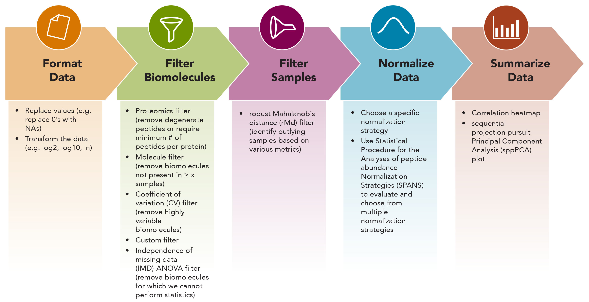

```{r global_options, include = FALSE}
knitr::opts_chunk$set(warning=FALSE, fig.width = 8, fig.height = 6)

```

```{r logo, out.width = "100px", echo=FALSE}


library(pmartR)
library(pmartRdata)
library(ggplot2)
library(reshape2)
```

This vignette describes the pmartR package functionality for quality control (QC) processing of mass spectrometry (MS) pan-omics data, in particular proteomics data at the peptide level. This includes data transformation, specification of groups that are to be compared against each other, filtering of features and/or samples, data normalization, and data summarization (correlation, principal components analysis). It is based on example data in the pmartRdata package. 

Additional datasets available in the pmartRdata package include the following data types: protein level data, lipidomic data, and metabolomic data. A separate vignette describes the statistical analysis capabilities of pmartR.


## Data

Below we load in 3 data.frames from the pmartRdata package: 

- `pep_edata`: A $p * (n + 1)$ data.frame of expression data, where $p$ is the number of peptides observed and $n$ is the number of samples (an additional peptide identifier/name column should also be present anywhere in the data.frame). Each row corresponds to data for each peptide.

- `pep_fdata`: A data.frame with $n$ rows. Each row corresponds to a sample with one column giving the unique sample identifiers found in e_data column names and other columns providing qualitative and/or quantitative traits of each sample.

- `pep_emeta`: An optional data.frame with at least $p$ rows. Each row corresponds to a peptide with one column giving peptide names (must be named the same as the column in `e_data`) and other columns giving meta information (e.g. mappings of peptides to proteins).

```{r data0, include=FALSE}
knitr::opts_chunk$set(fig.width=8)
knitr::opts_chunk$set(fig.height=6)

data("pep_edata")
data("pep_fdata")
```

Here, $p$ is `r nrow(pep_edata)` and $n$ is `r nrow(pep_fdata)`. The `pep_fdata` data.frame contains the sample identifier and the condition designation for each sample, either 'Infection' (samples that were infected with some pathogen) or 'Mock' (uninfected samples used as a control). The `pep_emeta` data.frame contains the peptide identifier column ('Mass_Tag_ID'), the protein identification name to which each mass tag ID maps ('Protein'), a reference identifier ('Ref_ID'), and the peptide sequence (Peptide_Sequence). Note that the mass tag IDs are unique ($n_{peptide} =$ `r length(unique(pep_emeta$Mass_Tag_ID))`) while the protein identifiers are not ($n_{protein} =$ `r length(unique(pep_emeta$Protein))`) since multiple peptides often map to the same protein.

```{r data1}
data("pep_edata")
dim(pep_edata)
pep_edata[1:6,1:5]
data("pep_fdata")
dim(pep_fdata)
head(pep_fdata)
data("pep_emeta")
dim(pep_emeta)
head(pep_emeta)
```

Next we create pepData object, which contains the 3 components loaded above. During object creation, we specify the names of the identifier columns in the `e_data`, `f_data`, and `e_meta` components of the data (`edata_cname = "Mass_Tag_ID", emeta_cname = "Protein", fdata_cname = "SampleID"`, respectively), as well as the scale of the data (`data_scale = "abundance"`). We can use the `summary` function to get basic summary information for our pepData object.

```{r data2}
mypepData <- as.pepData(e_data = pep_edata, f_data = pep_fdata, e_meta = pep_emeta, edata_cname = "Mass_Tag_ID", emeta_cname = "Protein", fdata_cname = "SampleID", data_scale = "abundance")
class(mypepData)
summary(mypepData)
```

Alternatively, the pmartRdata package contains the corresponding pepData object, which can be loaded as follows.

```{r data3}
data("pep_object")
class(pep_object)

rm(pep_object)
```

We can use the `plot()` function to display box plots for each sample in the pepData object.

```{r data4}
plot(mypepData)
```


### Additional Data

Also included in the pmartR package are protein, metabolite, and lipid data, in analagous formats to the peptide data described above.

Finally, we include .csv versions of the metabolite data (e_data and f_data), where the sample names have been modified to begin with numbers and contain dashes. These are included to illustrate use of the "check.names" argument to the \code{read.csv()} (and \code{data.frame()}) functions. If we read in the e_data file without specifying \code{check.names = FALSE}, R automatically puts an "X" at the beginning of the sample names so they do not begin with a number and replaces the dashes with periods. This causes the sample names in e_data to not match the sample names in f_data, and will prevent the creation of a metabData object.

```{r checknamesFALSE}
edata <- read.csv(system.file("extdata", "metab_edata_sample_names.csv", package="pmartRdata"), header=TRUE)
names(edata)

fdata <- read.csv(system.file("extdata", "metab_fdata_sample_names.csv", package="pmartRdata"), header=TRUE)

# Do the sample names match each other? #
all(names(edata)[-1] == fdata$SampleID)

```

To avoid this, without having to modify the sample names in f_data, we can specify \code{check.names=TRUE}:

```{r checknamesTRUE}
edata <- read.csv(system.file("extdata", "metab_edata_sample_names.csv", package="pmartRdata"), header=TRUE, check.names=FALSE)
names(edata)

# Do the sample names match each other? #
all(names(edata)[-1] == fdata$SampleID)
```


## Workflow

Once the pepData object is created, a typical QC workflow follows the figure below. 


```{r workflowFig, out.width = "600px", echo=FALSE, fig.cap = "Figure 1. Quality control and processing workflow in pmartR package."}

```

We will walk through the steps in this QC workflow using `mypepData`.

### Format Data

Sometimes omics abundance data contains 0s when the particular biomolecule was not detected for a given sample. It is our practice to replace any 0s with NAs as opposed to imputing the missing values. We strongly prefer NAs to imputation because we cannot know whether the biomolecule is not present in the sample, simply was below the limit of detection, or was present but missing from our data at random. The function `edata_replace()` can be used to replace values in the pepData object.

```{r format1}
mypepData <- edata_replace(mypepData, x = 0, y = NA)
```

In this dataset, there were no 0s so nothing was replaced.

We also highly recommend log transforming the data prior to analysis. pmartR supports log2, log10, and natural logarithm transformations. The `edata_transform()` function provides this capability. We can also use `edata_trasnform()` to transform the data back to the abundance scale if needed. Note that the scale of the data is stored and automatically updated in the `data_info$data_scale` attribute of the pepData object. Below we log10 transform the data, then return to the abundance scale, and finally settle on the log2 scale.

```{r format2}
mypepData <- edata_transform(mypepData, data_scale = "log10")
attributes(mypepData)$data_info$data_scale

mypepData <- edata_transform(mypepData, data_scale = "abundance")
attributes(mypepData)$data_info$data_scale

mypepData <- edata_transform(mypepData, data_scale = "log2")
attributes(mypepData)$data_info$data_scale

plot(mypepData)
```

Finally, we are preparing this data for statistical analysis where we will compare the samples belonging to one group to the samples belonging to another, and so we must specify the group membership of the samples. We do this using the `group_designation()` function, which modifies our pepData object and returns an updated version of it. Up to two main effects and up to two covariates may be specified, with one main effect being required at minimum. For the example data, we only have one option - specify the main effect to be "Condition" - since we do not have any additional information about the samples. Certain functions we will use below require that groups have been designated via the `group_designation()` function.

```{r format3}
mypepData <- group_designation(mypepData, main_effects = "Condition", covariates = NULL)
```

The `group_designation()` function creates an attribute of the dataset as follows:

```{r format4}
attributes(mypepData)$group_DF

plot(mypepData, color_by = "Condition", bw_theme=TRUE)
```


### Filter Peptides

It is often good practice to filter out peptides that do not meet certain criteria, and we offer 5 different filters. Each of the filtering functions calculates metric(s) that can be used to filter out peptides and returns an S3 object. Using the `summary()` function produces a summary of the metric(s) and using the `plot()` function produces a graph. Filters that require a user-specified threshold in order to actually filter out peptides have corresponding `summary` and `plot` methods that take optional argument(s) to specify that threshold. Once one of the 5 peptide level filter functions has been called, the results of that function can be used in conjunction with the `applyFilt()` function to actually filter out peptides based on the metric(s) and user-specified threshold(s) and create a new, filtered pepData object.

#### Proteomics Filter

The proteomics filter is applicable only to peptide level data that contains the `e_meta` component, as it counts the number of peptides that map to each protein and/or the number of proteins to which each individual peptide maps. It returns a list of two character vectors, the first, `peptides_filt`, giving degenerate peptide names. The second, `proteins_filt`, gives the names of proteins which no longer have peptides mapping to them in the dataset. This filter does not require a user-specified threshold.

```{r proteomics_filter}
myfilter <- proteomics_filter(mypepData)
summary(myfilter)
plot(myfilter, bw_theme=TRUE)
```

With the current dataset, the majority of proteins have one peptide mapping to them (graph on the left) and all peptides map to a single protein (e.g. no degenerate peptides; graph on the right). 

#### Molecule Filter

The molecule filter allows the user to remove from the dataset any biomolecule not seen in at least `min_num` of the samples. The user may specify a threshold of the minimum number of times each biomolecule must be observed across all samples; the default value is 2.

```{r molecule_filter}
myfilter <- molecule_filter(mypepData)
plot(myfilter, bw_them = TRUE)
summary(myfilter, min_num = 3)
```

Setting the threshold to 3, we would filter 3,342 peptides out of the dataset. If we'd like to make the filter less stringent, we could use a threshold of 2 and only filter 1,872 peptides. 

```{r molecule_filter2}
summary(myfilter, min_num = 2)
#plot(myfilter, min_num = 2)

mypepData <- applyFilt(filter_object = myfilter, mypepData, min_num = 2)
summary(mypepData)
```


#### Coefficient of Variation Filter

The coefficient of variation (CV) filter calculates the pooled CV values as in [@ahmed1995pooling].

The user can then specify a CV threshold, above which peptides are removed.

```{r cv_filter}
myfilter <- cv_filter(mypepData)
summary(myfilter, cv_threshold = 150)
plot(myfilter, cv_threshold = 150, title_size = 15)

mypepData <- applyFilt(filter_object = myfilter, mypepData, cv_threshold = 150)
summary(mypepData)

```


#### Custom Filter

Sometimes it is known a priori that certain peptides or samples should be filtered out of the dataset prior to statistical analysis. Perhaps there are known contaminant proteins, and so peptides mapping to them should be removed, or perhaps something went wrong during sample preparation for a particular sample. On the other hand, it may be preferred to specify peptides or samples to keep (removing those not explicitly specified), and this can also be accomplished. Keep in mind that both 'remove' and 'keep' arguments cannot be specified together; either 'remove' arguments only or 'keep' arguments only may be specified in a single call to custom_filter(). 

Here, we demonstrate the removal of the peptide with Mass Tag ID 1047 and sample `Infection 1` as an example.

```{r custom_filter}
myfilter <- custom_filter(mypepData, e_data_remove = 1047, e_meta_remove = NULL, f_data_remove = "Infection1")
summary(myfilter)

mypepData_temp <- applyFilt(filter_object = myfilter, mypepData)
summary(mypepData_temp)


rm(mypepData_temp)
```

We also demonstrate how to use this filter with the 'keep' option by keeping the samples `Infection 1`, `Infection 2`, `Infection 3`, `Infection 4` and `Infection 5`.

```{r custom_filter2}
myfilter2<- custom_filter(mypepData, e_data_keep = NULL, e_meta_keep = NULL, f_data_keep = c("Infection1", "Infection2", "Infection3", "Infection4", "Infection5"))
summary(myfilter2)

mypepData_temp2<- applyFilt(filter_object = myfilter2, mypepData)
summary(mypepData_temp2)

rm(mypepData_temp2)
```

Note that there is a `summary()` method for objects of type custom_filt, but no `plot()` method.

#### IMD-ANOVA Filter 

The IMD-ANOVA filter removes peptides that do not have sufficient data for the statistical tests available in the pmartRstat package; these are ANOVA (quantitative test) and an independence of missing data (IMD) using a g-test (qualitative test). When using the `summary()`, `plot()`, and `applyFilt()` functions, you can specify just one filter (ANOVA or IMD) or both, depending on the tests you'd like to perform later. Using this filter speeds up the process of performing the statistical tests. 

```{r imdanova_filter1}
myfilter <- imdanova_filter(mypepData)
```

Here we consider what the filter would look like for both ANOVA and IMD.

```{r imdanova_filter2}
summary(myfilter, min_nonmiss_anova = 2, min_nonmiss_gtest = 3)

#plot(myfilter, min_nonmiss_anova = 2, min_nonmiss_gtest = 3)
```

Here we consider what the filter would look like for just ANOVA.

```{r imdanova_filter3}
summary(myfilter, min_nonmiss_anova = 2)
#plot(myfilter, min_nonmiss_anova = 2)
```

Here we consider what the filter would look like for just IMD.

```{r imdanova_filter4}
summary(myfilter, min_nonmiss_gtest = 3)
#plot(myfilter, min_nonmiss_gtest = 3)
```

Now we apply the filter for both ANOVA and IMD.

```{r}
mypepData <- applyFilt(filter_object = myfilter, mypepData, min_nonmiss_anova = 2, min_nonmiss_gtest = 3)

summary(mypepData)
```

### Filter Samples

To identify any samples that are potential outliers or anomalies (due to sample quality, preparation, or processing circumstances), we use a robust Mahalanobis distance (rMd) [@matzke2011improved] score based on 2-5 metrics. The possible metrics are:

- Correlation 

- Proportion of data that is missing ("Proportion_Missing")

- Median absolute deviation ("MAD")

- Skewness

- Kurtosis

The rMd score can be mapped to a p-value, and a p-value threshold used to identify potentially outlying samples. In general, for proteomics data we recommend using correlation, proportion missing, MAD, and skew. A plot of the rMd values for each sample is generated, and specifying a value for 'pvalue_threshold' results in a horizontal line on the plot, with samples above the line slated for filtering at the given threshold.


```{r rmd1}
myfilter <- rmd_filter(mypepData, metrics = c("Correlation", "Proportion_Missing", "MAD", "Skewness"))
plot(myfilter, bw_theme=TRUE)

summary(myfilter, pvalue_threshold = 0.001)
plot(myfilter, pvalue_threshold = 0.001, bw_theme=TRUE)


```

Using the output from the `summary()` function, we can explore the outliers identified to see what metrics are driving their outlier-ness. Box plots for each metric are graphed, with the specified sample marked with an 'X'.


```{r rmd2}
plot(myfilter, sampleID = "Infection5", bw_theme=TRUE)
plot(myfilter, sampleID = "Infection8", bw_theme=TRUE)
```

We can see that Infection5 has the highest MAD, low skewness, and almost the lowest correlation, but the lowest proportion missing compared to the other samples. Infection 8 has MAD close to the median MAD value, the highest skew, the lowest correlation, and the highest proportion of missing data. We can use this information to determine whether to remove either or both of these samples. Sometimes it is also useful to look at additional data summaries to inform outlier removal, such as a principal components plot or correlation heat map (below).

### Normalize Data

The next step in a typical workflow is to normalize the data. 

Normalization approaches consist of a subset method and a normalization function [@aastrand2003contrast],[@gautier2004affy]. Available subset methods include:

- Percentage of peptides present (PPP): Subset the data to peptides present in at least $p$ percent of samples. This subset method is specified as "ppp".

- Rank invariant peptides (RIP): First subset peptides to those present in every sample (e.g. complete peptides). Next, subject each peptide to a Kruskal Wallis test on group, and those peptides *not* significant at a given p-value threshold are retained as invariant. This subset method is specified as "rip".

- PPP-RIP: Rank invariant peptides among peptides present in a given percentage of samples. This subset method is specified as "ppp_rip".

- Top "l" order statistics (LOS): The peptides with intensities in the top "l" order statistics are retained. This subset method is specified as "los".

Available normalization functions include:

- Median centering: The sample-wise median (median of all peptides in a given sample) is subtracted from each peptide in the corresponding sample. This normalization method is specified as "median".

- Mean centering: The sample-wise mean (mean of all peptides in a given sample) is subtracted from each peptide in the corresponding sample. This normalization method is specified as "mean".

- Z-score transformation: The sample-wise mean (mean of all peptides in a given sample) is subtracted from each peptide, and the result is divided by the sample-wise standard deviation (standard deviation of all peptides in a given sample) in the corresponding sample. This normalization method is specified as "zscore".

- Median absolute deviation (MAD) transformation: The sample-wise median (median of all peptides in a given sample) is subtracted from each peptide, and the result is divided by the sample-wise MAD (MAD of all peptides in a given sample) in the corresponding sample. This normalization method is specified as "mad".

There are two ways to go about normalizing data in the pmartR package. If you know the normalization approach you'd like to use, you can directly specify it in the `normalize_data()` function. Or, if you want to see how compatible different normalization approaches are with your dataset, you can use the `spans_procedure()` function.

We can go straight to the normalization, if we know what approach we want to use.

```{r norm2}

# Normalize using all peptides and median centering #
norm_object <- normalize_global(omicsData = mypepData, subset_fn = "all", norm_fn = "median", apply_norm = FALSE, backtransform = TRUE)
norm_data <- normalize_global(omicsData = mypepData, subset_fn = "all", norm_fn = "median", apply_norm = TRUE, backtransform = TRUE)
plot(norm_data, title_plot="Normalized Data: Median Centering Using all Peptides", title_size=12)

# Normalize using RIP 0.2 and median centering #
norm_object <- normalize_global(omicsData = mypepData, subset_fn = "rip", params=list(rip=0.2), norm_fn = "median", apply_norm = FALSE, backtransform = TRUE)
norm_data <- normalize_global(omicsData = mypepData, subset_fn = "rip", params=list(rip=0.2), norm_fn = "median", apply_norm = TRUE, backtransform = TRUE)
plot(norm_data, title_plot="Normalized Data: Median Centering Using RIP 0.2 Peptides", title_size=12)

```


Below we use SPANS to select a normalization approach and then normalize the data.

```{r spans}
# returns a dataframe arranged by descending SPANS score
spans_result <- spans_procedure(mypepData)

```

```{r spans_plot_summarize}
summary(spans_result)
plot(spans_result)
```

```{r spans_normalize, eval = FALSE}
# a list of the parameters for any normalization procedure with the best SPANS score
best_params <- get_spans_params(spans_result)

# there are a few ties, all using ppp_rip, well select the method that uses median normalization and parameters ppp = 0.1 and rip = 0.1
subset_fn = best_params[[1]]$subset_fn
norm_fn = best_params[[1]]$norm_fn
params = best_params[[1]]$params

# we now pass the extracted subset function, normalization function, and parameters from SPANS to normalize_global()
norm_object <- normalize_global(omicsData = mypepData, subset_fn = subset_fn, norm_fn = norm_fn, params = params)
```


### Summarize Data

The pmartR package contains various methods for data summarization and exploration that can be used as part of the QC process: numeric summaries and associated plots (via the `edata_summary()` function), sequential projection pursuit principal components analysis (sppPCA) for dimension reduction (via the`dim_reduction()` function), and a correlation heat map (via the `cor_result()` function)[@stacklies2007pcamethods]. As for missing data summarization there are also functions to collect and plot missing data information. Missing data collection and plotting functions include, `missingval_result()`, `plot_missingval()`, `missingval_scatterplot()` and `missingval_heatmap()`. 

#### Numeric Summaries

We can generate numeric summaries of our data by either sample or molecule. The `edata_summary()` function computes the mean, standard deviation, median, percent of observations for which a value was observed, the minimum value, and the maximum value.

```{r edata_summary}
edata_summary(omicsData = norm_data, by = "sample", groupvar = NULL)

#edata_summary(omicsData = norm_data, by = "molecule", groupvar = "Condition")
#edata_summary(omicsData = norm_data, by = "molecule", groupvar = NULL)

```

#### Probabilistic Principal Components Analysis

Probabilistic is a PCA algorithm that can be used in the presence of missing data. We use the `dim_reduction()` function in pmartR, specifying the dataset and the number of principal components to return (default value of 2 principal components). The `summary()` and `plot()` functions operate on the results of the `dim_reduction()` function.

Note that `dim_reduction()` requires that the `group_designation()` function has been run.

```{r sppPCA}
pca_results <- dim_reduction(norm_data, k = 2)

summary(pca_results) 
plot(pca_results, bw_theme=TRUE)
```


#### Correlation Heatmap

Pearson correlation between samples is calculated based on pairwise complete biomolecules. 

```{r corr}
correlation_results <- cor_result(norm_data)

summary(correlation_results)
plot(correlation_results)


```


#### Missing Data

Patterns of missing data can be explored using the `missingval_result()` and `plot_missingval()` functions.


```{r missingval}

results <- missingval_result(mypepData)


plot(results, type = "bySample")
plot(results, type = "byMolecule")

```


In addition, the `missingval_scatterplot()` and `missingval_heatmap()` functions provide more views of the missing data.


```{r missingval_plots}

missingval_scatterplot(mypepData, palette = "Set1")

missingval_heatmap(mypepData)

```


### Protein Quantification Methods

Protein quantification can be done using the `protein_quant()` function, either with or without accounting for different isoforms of the proteins, also called 'proteoforms'. Regardless of whether the user is accounting for protein isoforms, they must specify a method for rolling peptides up to proteins (one of "rollup", "rollup", "qrollup", or "zrollup") and a function to use for combining the peptide-level data (either "mean" or "median"). When the user does wish to account for protein isoforms, they have two options for doing so: Bayesian Proteoform Quantification (BP-Quant) [@webb2014bayesian] or Protein Quantification via Peptide Quality-Control (PQPQ). 

The `protein_quant()` function returns an object of class proData.

#### Rollup Methods

The rollup method takes either the mean or median of all peptides mapping to a given protein, and sets that value as the relative protein abundance.

In the rrollup method, all peptides that map to a single protein are scaled based on a chosen reference peptide, which is the peptide with most observations. Next the average or mean of the scaled peptides is set as the relative protein abundance. [@matzke2013comparative] 

The qrollup method starts with all peptides that map to a single protein. Next peptides are chosen according to an abundance cutoff value and the average or mean of the scaled peptides is set as the protein abundance.

In the zrollup method, scaling is done similarly to the  z-score formula (except with medians instead of means). The scaling formula is applied to peptides that map to a single protein and then the mean or median of the scaled peptides is set as protein abundance (from DAnTE article). The rollup method is similar to rrollup method, except there is no scaling involved in these methods. Either the mean or median is applied to all peptides that map to a single protein to obtain protein abundance. [@polpitiya2008dante]


```{r protein_quant, eval = FALSE}
print(mypepData)

mypepdata_median<- protein_quant(pepData = mypepData, method = "rollup", combine_fn = "median")
print(mypepdata_median)
rm(mypepdata_median)

mypepdata_rrollup<- protein_quant(pepData = mypepData, method = "rrollup")
print(mypepdata_rrollup)
rm(mypepdata_rrollup)

```


## References
