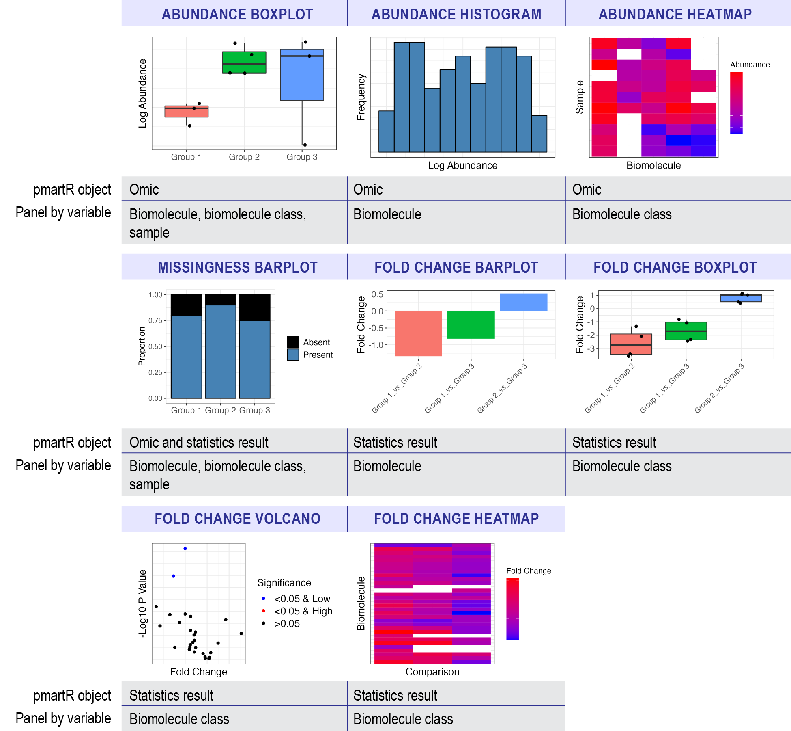

```{r setup, include=FALSE}
knitr::opts_chunk$set(echo = TRUE, warning = FALSE, message = FALSE)
library(pmartRdata)
library(pmartR)
library(dplyr)
library(patchwork)
```

## Introduction

A challenge of 'omics data is seeing trends on the biomolecule, sample, and biomolecule
class (i.e. peptide fragments from a protein) level due to the large number 
of individual plots to visualize. Trelliscope is an HTML tool which allows users to
search, sort, and filter plots based on **cognostics**, which include single data 
descriptors of the data like the mean, standard deviation, p-value, etc. 

The general workflow for the trelliscope builder functions in pmartR are as follows: 

1. build the trelliscope data object with an e_data file, omicsData object, statRes object, 
or both an omicsData and statRes object. (`as.trelliData.edata` or `as.trelliData`)

Note: The e_data file is an unprocessed expression matrix. The omicData object is 
a pepData, proData, lipidData, etc., object that has completed normalization if
required. The statRes object contains the statistics results following an 
imd-ANOVA.

2. select the variable to panel the data by (`trelli_panel_by`)

3. and finally, pass to the corresponding trelliscope building functions

Currently, abundance, missingness, and fold change plots are supported, and 
can be summarized as follows: 

```{r, echo = FALSE}
data.frame(
  `Input Data` = c(rep("Abundance", 3), "Missingness", rep("Fold Change", 4)),
  `Plot Type` = c("Boxplot", "Histogram", "Heatmap", "Barplot", "Barplot", "Boxplot", "Volcano", "Heatmap"),
  `Uses e_data` = c("X", "X", "", "X", rep("", 4)),
  `Uses omicsData` = c(rep("X", 4), rep("", 4)),
  `Uses statRes` = c(rep("", 3), rep("X", 5)),
  `Requires Biomolecule Class (e_meta)` = c("", "", "X", "", "", "X", "X", "X"),
  `Main Effects Used` = c("X", "", rep("X", 4), "", "")
) 
```

where "Input Data" is the type of data that will be plotted and "Plot Type" describes what
kind of plot would be generated in the trelliscope. "Uses e_data" describes plots
that can be made with just an e_data object using the `as.trelliData.edata` function. 
Similarly, "Uses omicsData" describes plots that can be made with an omicsData object
(pepData, proData, lipidData, nmrData, etc.) in the `as.trelliData` function. 
"Uses statRes" describes plots that can be built with a statRes object in `as.trelliData`;
however, most of these plots "Require e_meta" from omicsData to determine trelliscope
panels. The last column, "Main Effects used" describes any plot where the "main_effects" 
parameter in `pmartR::group_designation` plot was set. 

## Plot Summary 

```{r, echo = FALSE}

```

## Example Case 1: e_data Only

Let's start with the simplest input data to run these trelliscope functions, 
e_data. For context, a typical e_data file looks like this: 

```{r, echo = F}
pmartRdata::pep_edata[1:6,1:6]
```

where each of the rows are biomolecules and each of the columns are samples. Within
each e_data file, there must be one identifier column referred to as the "edata_cname."
The rest of the columns contain samples. With the exception of isobaric peptide data
and nmr data, all data types must be log transformed and normalized. After setting the
e_data and edata_cname parameters in the `as.trelliData.edata` function, 
the next step is to set the omics_type which are all currently supported pmartR
omics types. Set a transformation by first reporting the original data scale
in the data_scale_original and the desired scale in data_scale. "log2", "log10",
"log", and "abundance" (no transformation) are currently supported. 

To understand the array of normalization functions and parameters, see `?normalize_global`,
`?normalize_loess` and `?normalize_quantile`. Below, we have an example of valid
log transformation and normalization parameters. 

```{r}
trelliData1 <- as.trelliData.edata(
  e_data = pmartRdata::pep_edata,
  edata_cname = "Peptide",
  omics_type = "pepData",
  data_scale_original = "abundance",
  data_scale = "log2",
  normalization_fun = "global",
  normalization_params = list(subset_fn = "all", norm_fn = "median", apply_norm = TRUE,
    backtransform = TRUE)
)
```

After creating a trelliData object, the next step is to determine which variable 
to panel the data by. The `?summary` function provides a quick overview of 
potential plots that can be made.

```{r}
summary(trelliData1) 
```

With only an e_data file, there are only two potential options for panel by variables, 
which include the edata_cname (in this case, Peptide), and a "Sample" category which 
is comprised of the name of every column besides edata_cname. The plot, which 
corresponds to the table in the introduction, can be further investigated with
adding trelli and underscores to the name. For example, the "abundance boxplot" 
details be viewed with `?trelli_abundance_boxplot`. The last column tells you 
the number of plots that can be made with that trelliscope function. Note that trelliscopes
of more than 1,000 plots can take several minutes to be made. 

To set the panels for the trelliscope, use the `?trelli_panel_by` function. We only
have two options in this case, so a summary for plots where each panel is the 
biomolecule (edata_cname = "Peptide") looks like this:

```{r}
summary(trelliData1 %>% trelli_panel_by("Peptide")) 
```

which is the above table subsetted down to the only options available to plot
right now. The typical trelliscope parameters look like this: 

```{r, echo = FALSE}
data.frame(
  "Parameter Name" = c("cognostics", "ggplot_params", "interactive", "path", 
                       "name", "test_mode", "test_example", "single_plot"),
  "Description" = c("Set the specific cognostics of the trelliscope. Varies per plotting function.", 
                    "Pass parameters to the ggplot functions as a list of strings",
                    "Indicate whether plots should be interactive or not", 
                    "The path where the trelliscope will be outputted to",
                    "Name of the trelliscope display",
                    "Indicate whether the trelliscope should be subsetted to a few panels or not",
                    "The panels to subset the trelliscope to if test_mode is true",
                    "Output a single plot instead of a trelliscope display")
) 
```

See an example of how to use one of these functions below, with test_mode enabled.

```{r, echo = T, eval = F}
trelli_abundance_boxplot(
  trelli_panel_by(trelliData1, "Peptide"),
  cognostics = c("count", "mean abundance", "cv abundance"),
  include_points = TRUE,
  name = "Trelliscope",
  test_mode = TRUE,
  test_example = 3
)
```

Also, see "How Do I Change ggplot Parameters?" below to understand how to change axis and
title labels, sizes, and angles, as well as change plot colors, etc. All plotting commands
follow the ggplot2 library of functions. To see what each trelliscope looks like, start by 
investigating the default plot option with single_plot = TRUE and selecting a specific 
plot with test_example. 

**Abundance Boxplot**

Let's first create two panel_by trelliscope objects, one by "Lipid", and 
the other by "Sample". If we were to plot the first sample's boxplot 
abundance with include_points = TRUE, we would get too many points to view. Thus,
set include_points to FALSE. Since we've set "single_plot" to TRUE, we get an
example of one of the many plots that will be made and passed to trelliscope. We
can change which plot we're looking at with "test_example". On the left, we have 
a "Peptide" example and on the right, a "Sample" example, with the color changed
to avoid confusion. 

```{r}
# Panel by Mass Tag ID  
PeptideGroups <- trelli_panel_by(trelliData1, "Peptide")

# Panel by Sample
SampleGroups <- trelliData1 %>% trelli_panel_by("Sample") 

# Create an example boxplot 
Abun_Box_Edata <- trelli_abundance_boxplot(PeptideGroups, single_plot = TRUE, test_example = 3)

# Make an abundance boxplot without the points 
Abun_Box_Sample <- trelli_abundance_boxplot(SampleGroups, include_points = F, single_plot = T,
                                            ggplot_params = "scale_fill_manual(values = 'forestgreen')")

# Use patchwork to put plots together
Abun_Box_Edata + Abun_Box_Sample
```

**Abundance Histogram**

The abundance histogram is only supported for data that has been paneled by 
edata_cname. 

```{r, echo = T}
trelli_abundance_histogram(PeptideGroups, single_plot = TRUE, test_example = 3)
```

**Missingness Barplot**

We can also build a missingness bar plots. If we would rather see count 
information in the bar plot instead of proportions, we can easily set proportion to FALSE. 

```{r}
# Create an example bar plot 
Miss_Bar_Edata <- trelli_missingness_bar(PeptideGroups,
                                         single_plot = TRUE, test_example = 3,
                                         ggplot_params = "ggtitle('Biomolecule')")
# Make a missingness barplot 
Miss_Bar_Sample <- trelli_missingness_bar(SampleGroups,
                                          include_points = F, 
                                          proportion = FALSE, single_plot = T,
                                          ggplot_params = "ggtitle('Sample')")
# Put plots together with patchwork
Miss_Bar_Edata + Miss_Bar_Sample
```

These are all the currently supported plots for only e_data files. There are 
more options for omicsData and statRes listed below. 

## Example Case 2: omicsData Only

An omicsData object that is log transformed and normalized (with the exception of 
isobaric and nmr data) can be passed to the `as.trelliData` function which requires
either an omicsData or statRes object. 

```{r}
# Pull the example peptide object
peptide <- pmartRdata::pep_object

# Log transform the edata file 
peptide <- edata_transform(omicsData = peptide, data_scale = "log2")

# Set the group designation main effects 
peptide <- group_designation(omicsData = peptide, main_effects = "Phenotype")

# Filter the data to run the imd_anova
imdanova_Filt <- imdanova_filter(omicsData = peptide)
peptide <- applyFilt(filter_object = imdanova_Filt, omicsData = peptide, min_nonmiss_anova=2)

# Normalize the data. You may use the Kruskal-Wallis test from normRes_tests to 
# confirm that your normalization choice does not induce nor remove significance. 
peptide <- normalize_global(peptide, subset_fn = "rip", norm_fn = "median", 
                             apply_norm = TRUE, backtransform = TRUE)

# Create trelliData object
trelliData2 <- as.trelliData(omicsData = peptide)
```

If we summarize the plot options with `summary`, we get: 

```{r}
summary(trelliData2)
```

Since we included an e_meta object that has categorical data for e_data, there
are a lot more plotting options available then what was provided for the e_data file.
Additionally, we have provided grouping information with the "group_designation" 
function which will be incorporated into some of the plotting functions. Since we've 
already covered the trelliscope building functions, we will focus these next few 
sections on how each e_meta and group_designation affect each plot. 

**Abundance Boxplot**

The group_designation variables are utilized in the abundance boxplot when paneling
by edata_cname ("Peptide")...

```{r}
trelliData2 %>% 
  trelli_panel_by("Peptide") %>% 
  trelli_abundance_boxplot(test_example = 3, single_plot = T, ggplot_params = "xlab('Phenotype')")
```

...or by am e_meta variable. In this case, our options include RazorProtein and ProteinList.
Note that group_designation is used if included: 

```{r}
trelliData2 %>% 
  trelli_panel_by("RazorProtein") %>% 
  trelli_abundance_boxplot(test_example = 3, single_plot = T)
```

If we panel by the sample, the plot remains the same as in example case 1. 

**Abundance Histogram**

Since group_designation is not used in the histogram trelliscope plotting function,
it remains the same as in Example Case 1.

**Missingness Bar**

Once again, group_designation data is used if included, even if the panel_by
variable is an e_meta variable. 

```{r}
trelliData2 %>% 
  trelli_panel_by("Peptide") %>% 
  trelli_missingness_bar(test_example = 3, single_plot = T)
```

**Abundance Heatmap**

An advantage to including e_meta variables is the ability to use heatmaps, where 
each panel is an "e_meta" variable, one axis is the biomolecules within that 
biomolecule class, and the other axis is the samples in order by the "group_by"
designation.

```{r}
trelliData2 %>% 
  trelli_panel_by("RazorProtein") %>% 
  trelli_abundance_heatmap(test_example = 2, single_plot = T, ggplot_params = "coord_flip()")
```

## Example Case 3: statRes Only

Including statRes data allows for trelliscope plots that accept fold_change values.
To get a statRes object, pass your transformed, filtered, and normalized data to 
the `?imd_anova` function. 

```{r}
# Run an imd-anova
pepStats <- imd_anova(peptide, test_method = "anova")

# Pass that dataframe to the trelliData object builder
trelliData3 <- as.trelliData(statRes = pepStats)

# Run the summary function
summary(trelliData3)
```

There are only two trelliscope plotting options for statRes objects by themselves. 
The missingness plot, which we have seen above, and a fold change bar plot. 
Fold change plots have an additional parameters: p_value_thresh, which allows users to
set a significance threshold. 

**Foldchange Bar**

```{r}
trelliData3 %>%
  trelli_panel_by("Peptide") %>%
  trelli_foldchange_bar(p_value_thresh = 0.05, 
                        test_example = 10, single_plot = TRUE)
```

To see more fold change plot options, include an e_meta dataframe in the trelliData
object. 

## Example Case 4: omicsData and statRes 

Including both omicsData and statRes objects allows users the ability to run
all available plotting functions. Below, we will focus on the last fold change 
plots that we have yet to see. 

```{r}
# Build a trelliData object with both omicsData and statRes
trelliData4 <- as.trelliData(omicsData = peptide, statRes = pepStats)
summary(trelliData4)
```

**Fold Change Boxplot**

To create a fold change boxplot, the input data must be paneled by an e_meta
variable. 

```{r}
trelliData4 %>%
  trelli_panel_by("RazorProtein") %>%
  trelli_foldchange_boxplot(
    single_plot = TRUE,
    test_example = 2
  )
```

**Fold Change Heatmap**

These heatmaps shows fold change values per biomolecule (y-axis) and statistical 
comparison (x-axis).

```{r}
trelliData4 %>%
  trelli_panel_by("RazorProtein") %>%
  trelli_foldchange_heatmap(
    single_plot = TRUE,
    test_example = 2
  )
```

**Fold Change Volcano**

Volcano plots display the -log10 p-value versus the fold change values. Significant
values with a low fold change are colored blue, and high ones are colored red. These
plots require that a specific comparison is selected.

```{r}
trelliData4 %>%
  trelli_panel_by("RazorProtein") %>%
  trelli_foldchange_volcano(
    comparison = "Phenotype3_vs_Phenotype2",
    test_example = 2,
    single_plot = TRUE
  )
```

## How Do I...

#### Change ggplot parameters

To make tweaks to the ggplot objects, pass the commands as strings in a list.
For example: 

```{r}
trelliData2 %>% 
  trelli_panel_by("Peptide") %>% 
  trelli_abundance_boxplot(test_example = 3, single_plot = T,
    ggplot_params = c("ggtitle('CYC Human')", 
                      "ylab('Log Adjusted Abundance')",
                      "xlab('')", "theme_classic()", 
                      "theme(plot.title = ggplot2::element_text(hjust = 0.5))",
                      "theme(legend.position = 'none')")                       
  )
```

Below is the a list of common functions and what they do. 

```{r, echo = FALSE}
data.frame(
  Function = c("xlab('Name')", "ylab('Name')", "ggtitle('Name')", 
               "xlim(c(0,1))", "ylim(c(0,1))",
               "coord_flip()",
               "theme(axis.title.x = ggplot2::element_text(size=16))",
               "theme(axis.title.y = ggplot2::element_text(size=16))",
               "theme(axis.text.x = element_text(size=12))",
               "theme(axis.text.y = element_text(size=12))",
               "theme(axis.text.x = element_text(angle=90))",
               "theme(axis.text.y = element_text(angle=90))",
               "theme(plot.title = element_text(size=30))"
               ),
  Purpose = c("Rename x-axis label", "Rename y-axis label", "Rename plot",
              "Set the x-axis limits", "Set the y-axis limits",
              "Flip x- and y-axis",
              "Resize x-axis title", "Resize y-axis title",
              "Resize x-axis ticks", "Resize y-axis ticks",
              "Rotate x-axis ticks", "Rotate y-axis ticks",
              "Change plot title size"
              )
  
) 
```

For a list of other ggplot functions, [click here](https://ggplot2.tidyverse.org/reference/)

#### Make the plot interactive

Every plot has an interactive option by making interactive=TRUE. 

```{r}
trelliData2 %>% 
  trelli_panel_by("Peptide") %>% 
  trelli_abundance_boxplot(test_example = 3, single_plot = T, interactive = T)
```

#### Change cognostics 

Every trelliscope plotting function has default diagnostics that can be changed 
or removed completely by setting cognostics to "NULL". For example, if you were 
using the "trelli_abundance_boxplot" and only wanted a mean and median cognostic,
you could set cognostics to c("mean", "median").

```{r, echo = FALSE}
data.frame(
 Functions = c("trelli_abundance_boxplot", "trelli_abundance_histogram", 
               "trelli_abundance_heatmap", "trelli_missingness_bar",
               "trelli_foldchange_bar", "trelli_foldchange_boxplot",
               "trelli_foldchange_heatmap", "trelli_foldchange_volcano"),
 Cognostics = c("n, mean, median, sd, skew, p_value, fold_change", 
                "n, mean, median, sd, skew, p_value, fold_change",
                "n, mean, median, sd, skew",
                "n, proportion",
                "fold_change, p_value",
                "n, median, mean, sd",
                "n, median, mean, sd",
                "n")
) 
```

## Other FAQs

#### When is log transformation and normalization required?

For every e_data and omicsData object that is not isobaric proteomics or NMR data,
log transformation and normalization is required. 

#### How can I see my "panel_by" options? 

"panel_by_options" are stored attributes in all trelliData objects.

```{r}
attr(trelliData4, "panel_by_options")
```
